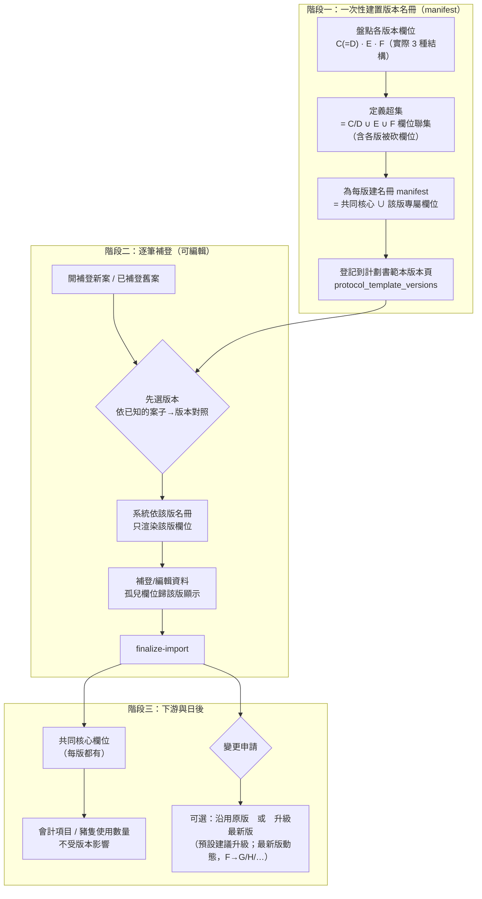

# 計畫書「版本名冊（manifest）」補登方案 — 設計記錄

> 狀態：**設計中（2026-07-09 與使用者對齊願景，先不動 code）**。
> 關聯：[[legacy-protocol-import]]、[[protocol-template-versions]]、[[approved-protocol-import]]。
> 前置分析：本檔「§3 三桶欄位」由三個 subagent 實讀 109 / 113 / 114 / 115 / 110005 各版申請文件抽取骨架比對而來。

---

## 1. 問題

補登舊計畫時，各年度用的計畫書**版本不同**（欄位／選項會變）。目前補登是在**現行 F 版數位表單**上做，於是：

- **F 版有、舊版沒有的欄位** → 舊件在這些格子留白，看起來像「漏填」，也可能誤觸必填。
- **舊版有、F 版砍掉的欄位（孤兒欄位）** → 舊件填過的資料，F 表單**沒有格子承接**。

且經實讀確認：**版本變動不是單調加欄**，而是「有加也有減」（例：C→E 新增替代方案平台勾選、移除試驗單位多站塊與 GLP 結果分析）。所以單靠「F 表單 + 不適用遮罩」無法忠實還原。

## 2. 決策（2026-07-09 本輪確認）

採 **(Y) 方案：單一超集資料 + 每版一張「名冊 manifest」**。

- **名冊 manifest**：一份宣告式清單，記「某一版計畫書有哪些欄位」。系統只有**一套填寫程式**，補登選了哪版就照該版名冊只顯示該版欄位。（比喻：不同年度的報稅表，格子不同；名冊＝「每版印了哪些格子」的對照。）
- **超集**：所有版本欄位的聯集（含孤兒欄位）。各版名冊 = 從超集中挑出的子集。
- **用途＝可編輯（非凍結）**：使用者澄清舊件之後**會走變更申請、要算會計項目、豬隻使用數量**，屬活紀錄，必須可編輯；編輯限定在該版名冊欄位範圍內。
- **孤兒欄位處理＝納入超集、歸該版所有**（使用者選定）：GLP 結果分析／統計、試驗單位多站塊、飼養環境 SOP、試驗物質 成份/來源/留樣/COA 等 → 進超集，C/E 版名冊顯示、F 版不顯示。
- **共同核心強制納入每版名冊**：會計、豬隻計數、變更申請吃的都是「每版都有的核心欄位」（動物資料 S7、iacuc_no、起訖日期、試驗物質…）。每版名冊都**強制包含**這組，確保下游功能不受版本影響。
- **版本判定＝手動選**：使用者可辨識每筆案子屬哪一版，補登時手動選版本（不靠自動偵測）。已補登舊件則**重新選版本**回填 `source_form_version`。
- **名冊落點**：
  - 「登記版本 + 選版本」→ 掛在**計劃書範本版本頁**（`protocol_template_versions` 版本登記簿）；補登「先選版本」下拉由此帶出。
  - 「名冊內容（每版精確欄位清單）」→ 建議**開發者維護成宣告式對照表**（只有 4 版、屬技術性欄位路徑資料），不做「admin 手點欄位」的 UI（除非日後要讓非工程人員自建新版）。
  - 「依版本渲染欄位」→ 發生在計畫書**補登/編輯頁**，不在範本頁。
- **邊界守則**：**現行 F 新案送件路徑不動**，版本機制只服務 legacy 補登的顯示與編輯。
- **變更申請版本策略（2026-07-09 決）**：走變更時可**選擇沿用原版**（該案 `source_form_version`）或**升級至最新版**；**預設建議升級最新版**。
- **版本須可持續擴充**（重要守則）：「最新版」為**動態解析**、非釘死 F——F 之後可能有 G/H/I/J/K。版本登記簿（範本頁）是**成長中的登記集**，「先選版本」下拉與「變更升級」皆由此動態帶出；名冊機制、超集、資料模型都要設計成「新增版本只加一列名冊」即可，不得把 F 當終態寫死。
- **系統機制欄位（2026-07-09 決）**：數位系統有、紙本各版皆無的操作型欄位（分機、附件上傳、電子簽名）＝**系統級**，全版本名冊都納入可用，不列入版本差異、不因版本隱藏。
- **F 專有欄位對 C/D/E 一律不顯示、不視為缺漏（2026-07-09 決）**：版本忠實——那版沒問就不出現（含痛苦症狀17、緩解措施4 等福祉評估）；**修正先前補登把這類欄當「真缺」的定性**。

## 3. 各版欄位實況（ground-truthed，2026-07-09 三 subagent 實讀 114003/113002/114009/115001/115012）

### 3.1 版次碼實況
- **C 案、D 案** → 文件都印 **AD-04-01-01C**，欄位結構**完全相同**（C=D，無任何欄位/選項差異；「C/D」是使用者的世代/行政標記，非表單改版）。
- **E 案** → **AD-04-01-01E**。
- **F 案（115012）+ 現行數位系統** → **AD-04-01-01F**。
- ⇒ 批次內實際只有 **3 種表單結構：C(=D)、E、F**。

### 3.2 版本演化（非單調，逐步加減）

| 步驟 | 新增 | 移除 |
|---|---|---|
| **C/D → E** | SD/PI 角色分離+SD email、委託單位聯絡人、替代方案 3 平台勾選+關鍵字+結論、簽核角色改稱 | 試驗單位 Test Unit 多站塊、結果分析(GLP)、文件與歸檔(GLP)、飼養環境 SOP 塊、試驗物質 11→5 欄、簽核 3→2 列 |
| **E → F** | 替代平台 3→8、痛苦症狀 17 勾選、緩解措施 4 勾選、資料庫 A~L、減量細分 3 塊(特殊照護/單獨飼養 9/再應用 5)、精緻化專塊、PI 職稱、計畫類型 5→6 項、是否重複 2→4 選項、疼痛 BCDE 細項勾選、「研究目的」改稱「計畫摘要 Abstract」 | 試驗物質類型 9、技術類別 9、註冊機關 5 |

### 3.3 重要修正（推翻先前推測）
先前推測「痛苦症狀17/緩解措施4/資料庫A~L/8平台/減量細分＝**數位系統獨有**」**是錯的**——F 紙本表單本身就印著這五組正式欄位（Table 20/21/31/6/9-11），數位系統只是照抄 F。它們是 **F 版新增的正式欄位**，不是數位獨有。原「三桶」框架作廢，改以本節 3.1–3.2 的實況為準。

### 3.4 超集與名冊
- **超集** = C/D 欄位 ∪ E 欄位 ∪ F 欄位（含各版被後版砍掉的欄位，如 C/D 的 GLP 結果分析、E 的試驗物質類型9）。
- **名冊 = 3 張不同欄位集**：**C/D 共用一張**、E 一張、F 一張。選版本 C/D/E/F 共 4 個標籤，其中 C、D 指向同一張名冊。
- **設計紅利**：採 (Y) 後，結構性「不適用」標記**不需要**——某案選其版本，該版沒有的欄位**直接不顯示**（非留白、非徽章），該版特有欄位照常顯示。真正還需「不適用」的只剩表單內條件性 N/A（如未手術→手術段），屬既有三態機制、與版本無關。
- **共同核心**（各版都有、下游會計/豬計數依賴）：S1 基本主幹、S3 試驗物質主幹、S4 麻醉/疼痛等級/終點/處置/危害/管制、S6 手術十小節、S7 動物、S8 人員 → 每版名冊都含。

## 4. 流程圖

## 5. 待辦 / 開放項

1. ✅ **逐版欄位盤點完成**（2026-07-09，見 §9）：S1–S10 各版名冊（C/D 共用、E、F）欄位差異全數定案，使用者逐段確認。
2. ✅ **案子→版本對照（2026-07-09 使用者提供，權威）**：見 §7。版本**逐案認定、橫跨 C/D/E/F**，非按資料夾年份。
3. ✅ **110005 已排除**（使用者裁定不補登，特殊採血 blanket 案）。（註：109032 經使用者指認為 **D 版**，非先前推測的前 C 世代舊申請表——先前 agent 讀到的 109 舊申請表為另一非批次案 APIG-109016。）
6. ✅ **結構全部盤定**（見 §3）：C=D（皆印 AD-04-01-01C）、E（AD-04-01-01E）、F（AD-04-01-01F，115012 實讀）；3 種結構、C/D→E→F 逐步加減已列表。**痛苦症狀/緩解措施/資料庫/8平台/減量細分＝F 正式欄位（非數位獨有）**。
4. ✅ **變更申請的版本策略（已決，見 §2）**：變更時可選「沿用原版」或「升級最新版」，**預設建議升級最新版**；最新版**動態解析**、版本登記簿持續擴充（F→G/H/I/J/K），不得把 F 當終態。
5. ✅ **資料模型已定**（見 §10.1）：`source_form_version`＝protocols 欄位；孤兒欄＝語意路徑。名冊來源/升級規則見 §10.2/10.3；實作任務拆解見 §11。

## 6. 下一步

進入**待辦 1**：逐 Section 盤點超集欄位 + 各版名冊。我先擺分析推導的每版清單，使用者逐段確認或增刪，不從白紙開始。

## 7. 案子 → 版本對照（2026-07-09 使用者提供，權威）

> 版本**逐案認定、橫跨 C/D/E/F**，與資料夾年份無關（同一 PIG-114 內即含 C/D/E）。此為各案 `source_form_version` 的依據。

| 版本 | 案號 | 筆數 |
|---|---|---|
| **C** | 114003, 114004, 114005, 114006, 114010 | 5 |
| **D** | 109032, 113002, 114009, 114017 | 4 |
| **E** | 113003, 114016, 114019, 114022, 114023, 114025, 115001, 115002, 115003, 115005, 115006, 115007, 115008, 115009, 115010, 115011, 115013 | 17 |
| **F** | 115012 | 1 |

- **110005 已排除**（使用者 2026-07-09 裁定，特殊採血 blanket 案不補登）。
- 合計 **27 筆**（C 5 / D 4 / E 17 / F 1）。
- **版次碼實況**：C 案、D 案文件皆印 `AD-04-01-01C`（C=D 欄位相同）；E 案 `AD-04-01-01E`；F 案 115012 `AD-04-01-01F`。實際 3 種結構，名冊只需 3 張（C/D 共用）。詳見 §3。

## 8. 欄位總表（超集 × C(=D)/E/F）

> 顏色版見同資料夾 `version-manifest-field-matrix.html`。類別：**核心**=各版都含（下游會計/豬計數依賴）；**C/D 孤兒**=E/F 已砍、進超集歸 C/D 名冊；**F 新增**=只在 F 名冊；**E 起**=E 才有、逐版遞增。✓ 有／— 無／數字=選項數／⚠ 待逐段確認。

| 欄位 | C/D | E | F | 類別 |
|---|:--:|:--:|:--:|---|
| **S1** 研究名稱（中/英） | ✓ | ✓ | ✓ | 核心 |
| GLP 開關 | ✓ | ✓ | ✓ | 核心 |
| 申請/核准 雙編號+雙日期 | ✓ | ✓ | ✓ | 核心 |
| 主持人 電話/email/地址 | ✓ | ✓ | ✓ | 核心（各版無分機） |
| └ PI 職稱 | — | — | ✓ | F 新增 |
| └ SD/PI 角色分離（+SD email） | — | ✓ | ✓ | E 起 |
| 委託單位 名稱/代表/電話/email | ✓ | ✓ | ✓ | 核心 |
| └ 委託單位 聯絡人 | — | ✓ | ✓ | E 起 |
| └ 委託單位 地址 | ✓ | — | — | C/D 孤兒（E 起移除，實讀確認） |
| 試驗機構+飼養場所 | ✓ | ✓ | ✓ | 核心 |
| 試驗單位 Test Unit 多站塊 | ✓ | — | — | C/D 孤兒 |
| 試驗時程 起訖 | ✓ | ✓ | ✓ | 核心（格式不同） |
| 簽章角色列數 | 3 | 2 | 2 | 核心 |
| **分類** 計畫類型 | 5 | 5 | 6 | F +第6其他 |
| 計畫種類 | 12 | 12 | 12 | 核心 |
| 試驗物質類型 | 9 | 9 | — | C/D 孤兒 |
| 技術類別 | 9 | 9 | — | C/D 孤兒 |
| 經費來源 | 6 | 6 | 6 | 核心（標籤微調） |
| 註冊權責機關（GLP） | 5 | 5 | — | C/D 孤兒 |
| **S2** 目的/計畫摘要 | ✓ | ✓ | ✓ | 核心（F 改稱 Abstract） |
| 替代—必要性 | ✓ | ✓ | ✓ | 核心 |
| 替代—搜尋平台 | 內文 | 3 | 8 | E 起遞增 |
| 替代—關鍵字+結論 | — | ✓ | ✓ | E 起 |
| 是否重複試驗 | 2 | 2 | 4 | F 擴選項 |
| 減量—設計/理由 | ✓ | ✓ | ✓ | 核心 |
| 減量—特殊照護 | — | — | ✓ | F 新增 |
| 減量—單獨飼養（9 原因） | — | — | ✓ | F 新增 |
| 減量—動物再應用（5 計畫） | — | — | ✓ | F 新增 |
| 精緻化原則（Refinement） | ✓ | ✓ | ✓ | 核心（C/D/E 併入研究設計節；F 獨立欄） |
| **S3** 使用試驗物質 開關 | ✓ | ✓ | ✓ | 核心 |
| 試驗/對照物質 基本 5 欄 | ✓ | ✓ | ✓ | 核心 |
| └ 成份/來源/特徵/留樣/留樣地點/COA | ✓ | — | — | C/D 孤兒 |
| **S4** 麻醉 是否+類型 | ✓ | ✓ | ✓ | 核心 |
| 試驗流程 | ✓ | ✓ | ✓ | 核心 |
| 飼養環境 SOP 塊 | ✓ | — | — | C/D 孤兒 |
| 疼痛等級 B/C/D/E | 描述 | 描述 | 勾選 | F 改細項勾選 |
| 痛苦症狀（17 項） | — | — | ✓ | F 新增 |
| 緩解措施（4 項） | — | — | ✓ | F 新增 |
| 飲食/飲水限制 | ✓ | ✓ | ✓ | 核心 |
| 實驗+人道終點 | ✓ | ✓ | ✓ | 核心 |
| 最終處置+安樂死方式 | ✓ | ✓ | ✓ | 核心 |
| 屍體處理 | ✓ | ✓ | ✓ | 核心 |
| 非藥用級物質 | ✓ | ✓ | ✓ | 核心 |
| 危害性物質+施用/保護/廢棄 | ✓ | ✓ | ✓ | 核心 |
| 管制藥品 | ✓ | ✓ | ✓ | 核心 |
| **GLP** 結果分析（允收/統計/判定） | ✓ | — | — | C/D 孤兒 |
| 研究文件與歸檔 | ✓ | — | — | C/D 孤兒 |
| **S5** 法源+參考文獻 | ✓ | ✓ | ✓ | 核心 |
| 資料庫搜尋 A~L | — | — | ✓ | F 新增 |
| **S6** 手術計畫書 6.1–6.10 | ✓ | ✓ | ✓ | 核心 |
| **S7** 動物資料（8 欄） | ✓ | ✓ | ✓ | 核心（豬計數依賴） |
| **S8** 人員（a–i / A–E） | ✓ | ✓ | ✓ | 核心 |
| **S9** 附件上傳 | 系統級 | 系統級 | 系統級 | 系統機制，全版本可用 |
| **S10** 電子簽名 | 系統級 | 系統級 | 系統級 | 系統機制，全版本可用（原紙本簽章存掃描） |

> **孤兒欄位（C/D 版顯示，E/F 已砍或 F 移除）共 9 項**：委託單位地址、試驗單位多站塊、試驗物質類型9、技術類別9、註冊機關5、試驗物質額外6欄、結果分析(GLP)、文件歸檔(GLP)、飼養環境SOP。
> **F 新增（C/D/E 無）**：PI職稱、痛苦症狀17、緩解措施4、資料庫A~L、減量細分3塊、類型第6項、是否重複4選項、疼痛細項勾選。

## 9. 逐 Section 名冊定案（累積）

### Section 1 研究資料 ✅（2026-07-09 定案）
- **核心（C/D · E · F 皆含）**：研究名稱(中/英)、GLP 開關、申請+核准雙編號雙日期、主持人 電話/email/地址、委託單位 名稱/代表/電話/email、試驗機構+飼養場所、試驗時程起訖、計畫種類12、經費來源6。
- **系統機制（全版本）**：分機。
- **C/D 專有（孤兒，E/F 已砍）**：委託單位地址、試驗單位 Test Unit 多站塊、試驗物質類型9、技術類別9、註冊權責機關5。
- **E 起才有**：SD/PI 角色分離+SD email、委託單位聯絡人。
- **F 專有**：PI 職稱、計畫類型第6項（其他）。
- 註：簽章角色 C/D 3列 vs E/F 2列＝屬簽名機制（S10 處理）。

### Section 2 研究目的／計畫摘要 ✅（2026-07-09 定案，使用者確認）
- **核心（C/D · E · F 皆含）**：目的及重要性（F 稱「計畫摘要 Abstract」，同欄）、替代—必要性/物種理由、減量—實驗設計/理由、**精緻化原則**（C/D/E 併入「研究設計與方法」節框架、F 拆為獨立欄）。
- **E 起才有**：替代—搜尋平台勾選（E 3 平台→F 8 平台）、替代—搜尋關鍵字+結論。
- **F 專有**：減量—特殊照護、單獨飼養（9 原因）、動物再應用（5 計畫）；是否重複他人試驗 4 選項（C/D/E 為 2 選項）。
- 差異皆由版本自動決定，無設計選擇。

### Section 3 試驗物質與對照物質 ✅（2026-07-09 定案，使用者確認）
- **核心（各版）**：是否使用試驗物質 開關、名稱、用途、保存規定、是否無菌/滅菌（+非無菌說明）、效期；對照物質同結構。
- **C/D 專有（孤兒，E/F 已砍）**：成份、來源、特徵描述、是否留樣、留樣地點、相關證明（COA/SDS）。
- **系統機制（全版本）**：佐證照片上傳。
- 實作註記：現行數位 F 另設「劑型」欄、以 photos 佐證；數位↔紙本欄位對應於實作時對齊，不影響版本忠實。

### Section 4 研究設計與方法 ✅（2026-07-09 定案，使用者確認）
- **核心（各版）**：麻醉 是否+類型（存活/非存活/氣麻/畜舒坦）、試驗內容及流程、疼痛等級 B/C/D/E、飲食飲水限制、實驗+人道終點、最終處置+安樂死方式（KCl/220V/其他+轉讓+其他）、屍體處理、非藥用級物質、危害性物質（生物/放射/化學）+施用/保護/廢棄、管制藥品。
- **C/D 專有（孤兒，E/F 已砍）**：試驗動物飼養環境 SOP 塊、結果分析（GLP：允收/統計/判定）、研究文件與歸檔（GLP）。
- **F 專有**：痛苦症狀 17 勾選、緩解措施 4 勾選、疼痛等級改「各級細項勾選」（C/D/E 僅級別+描述）。
- **決策（使用者）**：痛苦症狀17/緩解措施4 ＝**版本忠實，C/D/E 不顯示**（非「缺」，該版無此評估）；修正先前補登「真缺」定性。
- **系統機制（全版本）**：危害物/管制藥品 佐證照片。

### Section 5 相關規範及參考文獻 ✅（2026-07-09 定案）
- **核心（各版）**：法源依據 + 參考文獻（C/D/E 合併單一自由欄；數位 F 拆為 5.1 法源 + 5.3 引用文獻 repeater）。
- **F 專有**：資料庫搜尋 A~L（12 項勾選）。

### Section 6 手術計畫書 ✅（2026-07-09 定案）
- **全核心（各版一致）**：6.1 手術種類、6.2 術前準備、6.3 無菌措施 5 項、6.4 手術內容、6.5 術中監控、6.6 存活術後影響、6.7 多次手術、6.8 術後照護（骨科/非骨科）、6.9 預期結束、6.10 手術用藥。用藥表列數不同＝填答差異、非結構。無版本差異、無設計選擇。

### Section 7 實驗動物資料 ✅（2026-07-09 定案）
- **全核心（各版一致）**：物種/品系、性別、使用量、年齡、體重、動物來源、飼養場所。下游豬隻使用數量依賴此節。無版本差異。

### Section 8 試驗人員資料 ✅（2026-07-09 定案）
- **全核心（各版一致）**：姓名、職稱、工作內容 a–i、參與年數、訓練資格 A–E、訓練證書。無版本差異。

### Section 9 附件 ✅ / Section 10 電子簽名 ✅（2026-07-09 定案）
- 皆歸**系統機制欄位（全版本可用）**：附件上傳、電子簽名（原紙本手寫簽章存掃描）。簽章角色列數差異（C/D 3 列 vs E/F 2 列）為紙本呈現，數位以電子簽名統一。

## 10. 實作規劃（schema 與接線；仍不動 code）

### 10.1 資料模型（2026-07-09 決）
- **`source_form_version` ＝ `protocols` 表獨立欄位**（nullable TEXT，值 C/D/E/F/未來 G…）。第一級屬性、與 `import_pending` 同層、可查詢/篩選；新案 null＝視為最新版；legacy 匯入手動選；變更升級時更新為新版。加欄 migration 低風險（nullable）。
- **孤兒欄位＝沿用語意路徑**（不用 `_legacy_extra`）：試驗單位→`basic.test_unit`、GLP 結果分析→`results_analysis`、GLP 文件歸檔→`document_archiving`、飼養環境 SOP→`design.housing_environment_sop`、試驗物質額外欄→`items.test_items[].{composition,source,characteristics,retention,retention_location,coa}`。**重用既存但未渲染的型別**（`basic.test_item_type` / `tech_categories` / `registration_authorities` / `sd.{name,email}` / `facility.address` / items 的 expiry 等）；缺的才在語意位置新增。升降級搬移自然、報表查詢一致。

### 10.2 名冊掛載與版本清單（2026-07-09 決）
- **名冊內容＝程式端宣告式常數 `VERSION_MANIFESTS`**（keys＝C/D/E/F，D→C，值＝欄位路徑清單）＝**功能真相源**（新版必改 code 加 manifest）。
- **「先選版本」下拉＝讀常數 keys**；放補登/編輯頁 + 已補登件「重選版本」動作。
- **`protocol_template_versions` 範本頁＝人看的登記簿**（顯示版本清單/生效日），與常數 keys 對齊、功能不依賴。

### 10.3 變更升級搬移規則（2026-07-09 決）
- 升級＝**只切換渲染名冊、不自動搬移**。
- F 隱藏欄（C/D 孤兒）→ **資料保留不刪**（可逆）；F 新欄空白待填；需語意重組欄（精緻化 C/D/E 併入研究設計節↔F 獨立欄、試驗物質 11→5）→ **不自動搬、給複製提示**；升級後 F 新欄**不強制必填**（放寬驗證，避免小變更被逼補全 F 表）。

## 11. 實作階段任務拆解（待使用者 go；仍未動 code）

1. **後端 migration**：`protocols` 加 `source_form_version`（nullable TEXT）；`ProtocolWorkingContent` 型別補齊孤兒欄位（多數型別已存在，補 GLP 結果分析/文件歸檔/試驗單位/飼養SOP/試驗物質額外欄）。
2. **名冊常數** `VERSION_MANIFESTS`（C/D/E/F 欄位路徑清單，D→C）。
3. **前端**：補登/編輯頁「先選版本」下拉 + 依 manifest 過濾渲染欄位 + 「重選版本」動作。
4. **驗證**：依 manifest 放寬必填（該版沒有的欄不擋、F 新欄升級後不強制）。
5. **範本頁**：顯示版本清單（對齊常數）。
6. **變更升級**：切名冊不搬資料 + 精緻化複製提示。
7. **回填**：27 筆既有匯入件依 §7 對照設 `source_form_version`。
8. **測試 + 部署**（migration 選號查 prod、rebuild api/web、健檢）。

## 12. 實作進度（2026-07-09，branch `feat/protocol-version-manifest-backfill`，8 commits）

**✅ 已完成並驗證（cargo check --tests + clippy / tsc + eslint 全綠）**
- 後端：migration 125（`source_form_version` 欄）、migration 126（27 筆回填，冪等）；`Protocol` / `ImportApprovedProtocolRequest` / `UpdateProtocolRequest` 加欄；import_approved INSERT + update() COALESCE 接線（先選/重選/升級）；handler 窮舉解構歸內容類。
- 前端：名冊常數 `protocolVersionManifests.ts`（25 gated 欄 + helper）；`ProtocolWorkingContent` 補孤兒欄型別；匯入頁「先選版本」下拉；編輯頁 `formVersion` 貫入 sectionProps + 補登件「重選版本」控制項 + save 帶版本；**版本 gating（隱藏 F 專有）**：SectionGuidelines 資料庫 A~L、SectionPurpose 減量細分 3 塊、SectionDesign(PainCategorySection) 痛苦症狀17/緩解措施4/疼痛細項。

**⏳ 未完成（同 pattern，可續作）**
- 其餘 gating：SectionBasic pi.position（F）、替代平台勾選（E+）、sponsor.address / test_item_type / tech_categories / registration_authorities、是否重複 4→2 選項。
- **孤兒欄位 NEW 輸入 UI**：試驗單位塊 / GLP 結果分析 / 文件歸檔 / 飼養 SOP / 試驗物質額外 6 欄（型別已備，尚缺 C/D 顯示用輸入框）。
- validation.ts 依 manifest 放寬必填（#5）；範本頁版本清單 + 升級精緻化複製提示（#6）；acceptance test（#7）。
- **部署（需使用者 go：prod migration 125/126 + rebuild api/web + 健檢）**。
