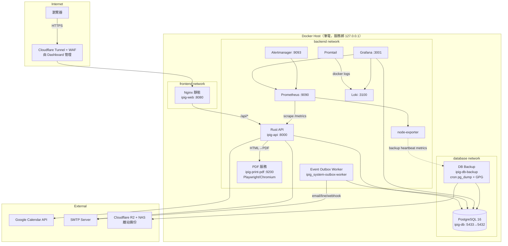
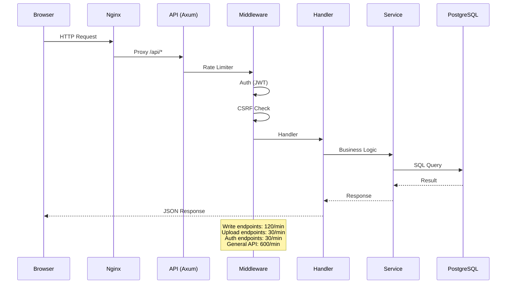
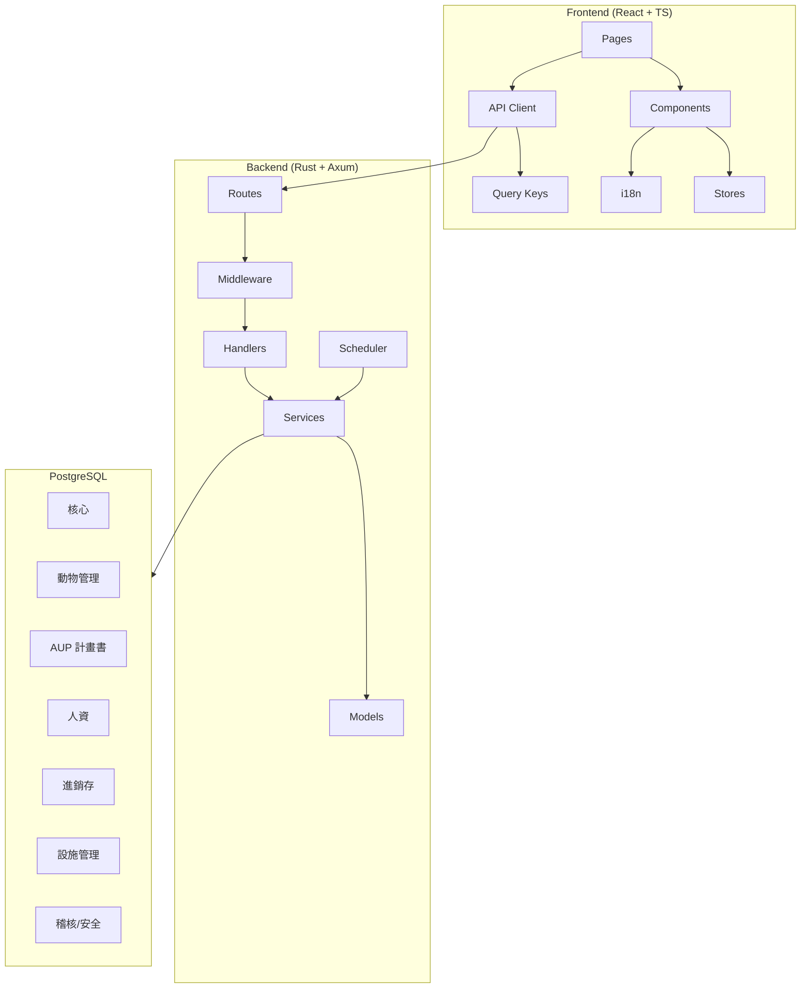
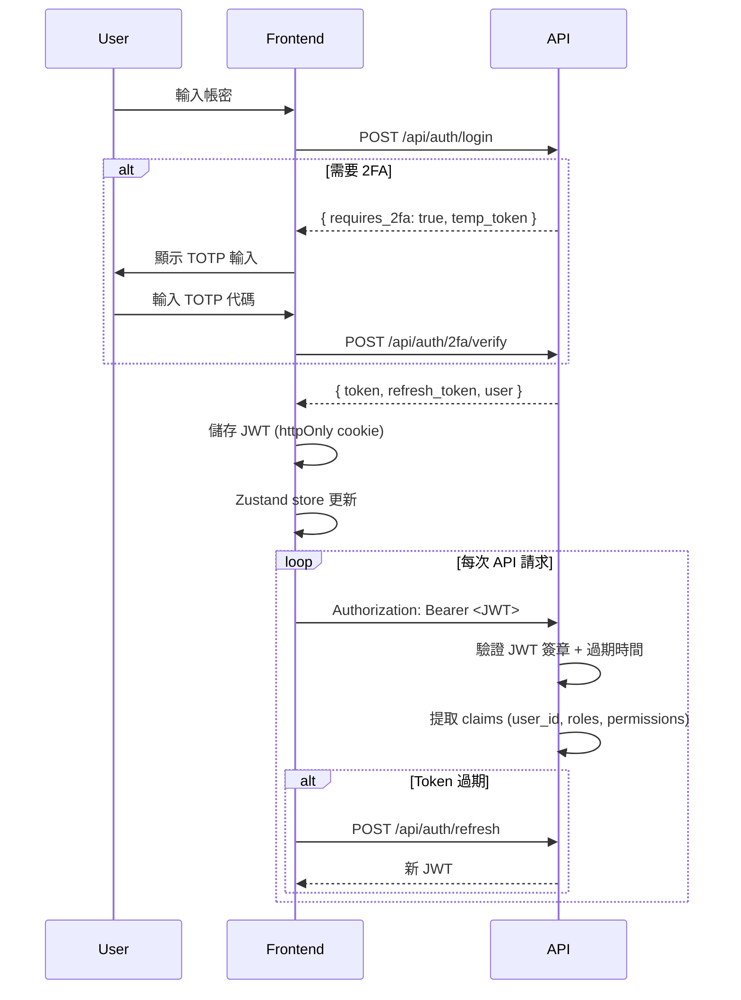

# iPig System 架構文件

> **最後更新**：2026-07-07（對齊現行 prod）
> **對象**：全體團隊成員與維護者
> **prod 事實**：系統跑在一台筆電的 Docker 上（一人開發+維運），observability 不可停。
> 服務全綁 `127.0.0.1`（不對外 `0.0.0.0`），對外流量僅經 Cloudflare Tunnel → web → api。

## 1. 部署架構

> 以下為現行 prod（`docker-compose.yml`）實際容器。前端跑 **production build（Nginx 靜態）**，
> **prod 無 Vite dev server**（`web-dev` 僅 `--profile dev` 手動啟用，不在 prod 拓樸內）；
> **無 Redis**（權限/session 快取為應用內 in-memory moka）。



**容器清單（現行 prod）**

| 容器 | 映像/建置 | 網路 | 角色 |
|------|-----------|------|------|
| `ipig-api` | 自建 Rust/Axum（cargo-chef, read-only rootfs） | backend + database | 後端 API |
| `ipig_system-outbox-worker` | 自建（`Dockerfile.outbox-worker`） | database | Event outbox 事件外送（email/line/webhook，保證投遞） |
| `ipig-web` | 自建 Nginx（靜態 SPA + `/api` 反代） | frontend + backend | 前端 production build |
| `ipig-db` | postgres:16-alpine（pg_stat_statements preload） | database | 主資料庫 |
| `ipig-db-backup` | 自建（`scripts/backup`） | database | 排程 pg_dump + GPG + rclone 至 R2/NAS 離站 |
| `ipig-print-pdf` | 自建（`services/print-pdf`） | backend | HTML→PDF 產生服務（**Playwright/Chromium** 引擎） |
| `ipig-prometheus` | prom/prometheus | backend | 指標收集 |
| `ipig-grafana` | grafana/grafana | backend + database | 監控儀表板 |
| `ipig-alertmanager` | prom/alertmanager | backend | 告警路由 |
| `ipig-loki` | grafana/loki | backend | 集中式 log 收集 |
| `ipig-promtail` | grafana/promtail | backend | docker log 採集器 |
| `ipig-node-exporter` | prom/node-exporter | backend | 主機指標（CPU/記憶體/磁碟）+ backup heartbeat |

> `ipig-web-dev`（node:22 Vite）僅存在於 `--profile dev`，**不屬於 prod 拓樸**，勿列入部署圖。
> `services/print-pdf` 的 PDF 引擎已由 WeasyPrint 換成 **Playwright/Chromium**（`services/print-pdf/main.py`、
> `requirements.txt`、`Dockerfile` 均引用 Playwright）；⚠️ 待確認：`docker-compose.yml` 內對 print-pdf 的
> 少數註解仍寫「WeasyPrint」，屬過時註解，實際執行引擎為 Chromium。

## 2. 資料流



## 3. 模組架構



## 4. 認證流程



## 5. 技術堆疊

| 層級 | 技術 |
|------|------|
| **前端** | React 19（19.2.7）, TypeScript, Vite（production build，Nginx 靜態）, TailwindCSS, shadcn/ui |
| **狀態管理** | Zustand (auth/UI), TanStack Query (server state) |
| **動畫/圖表** | Framer Motion, Recharts |
| **圖示** | Lucide React |
| **後端** | Rust, Axum, SQLx, Tokio |
| **後端輔助** | lettre (Email), utoipa (OpenAPI), totp-rs (2FA), tower-http (CORS/壓縮) |
| **快取** | 應用內 in-memory **moka**（權限快取 5min TTL；AUP PDF 快取 30min）；**無 Redis** |
| **資料庫** | PostgreSQL 16, pg_stat_statements |
| **PDF 服務** | `print-pdf`（FastAPI + **Playwright/Chromium** HTML→PDF；已由 WeasyPrint 汰換） |
| **認證** | JWT（EC 簽章）+ Refresh Token（rotation）+ TOTP 2FA |
| **安全** | CSRF tokens, Rate limiting, DOMPurify, Argon2 hashing, HMAC 稽核鏈, AEAD at-rest 加密 |
| **容器** | Docker Compose, 三層網路隔離（frontend/backend/database）, Docker Secrets, 服務綁 127.0.0.1 |
| **監控** | Prometheus, Grafana, Alertmanager |
| **日誌** | Loki + Promtail（集中式 log 收集）, node-exporter（主機指標） |
| **對外拓樸** | Cloudflare Tunnel + WAF（Dashboard 管理）→ web → api，不對外開 0.0.0.0 |
| **CI/CD** | GitHub Actions, Dependabot, cargo-chef 快取 |

## 6. 目錄結構

```
ipig_system/
├── backend/
│   ├── src/
│   │   ├── config.rs            # 環境變數 + Docker Secrets
│   │   ├── constants.rs         # 應用常數 (快取 TTL、ETAG_VERSION、APP_NAME 等)
│   │   ├── error.rs             # AppError 統一錯誤
│   │   ├── routes.rs            # 路由定義
│   │   ├── handlers/            # HTTP 處理器（按模組分資料夾）
│   │   ├── services/            # 業務邏輯（~48 個模組 + 子目錄 animal/protocol/hr/
│   │   │                        #   messaging/notification/outbox/signature/stock/… 各含 mod.rs）
│   │   ├── middleware/          # Auth, CSRF, ETag, Rate Limiter
│   │   ├── models/              # DB 型別 + Request/Response
│   │   └── bin/                 # CLI 工具 (create_admin, verify_audit_chain 等)
│   ├── migrations/              # SQL 遷移腳本 (001–124+，持續增長)
│   ├── Dockerfile               # api：多階段 cargo-chef 建置
│   └── Dockerfile.outbox-worker # outbox-worker：獨立事件外送 process
├── frontend/
│   ├── src/
│   │   ├── pages/               # 路由頁面
│   │   ├── components/          # 共用/模組元件（含 layout/sidebarNavConfig, auth/GuestBlock）
│   │   ├── lib/
│   │   │   ├── api/             # axios client（含 guest interceptor）、業務域 API 拆分
│   │   │   ├── guest-demo/      # 訪客 demo 靜態假資料 + routes 映射表（見 GUEST_DEMO_ARCHITECTURE.md）
│   │   │   ├── sanitize, queryKeys, validations …
│   │   ├── stores/               # Zustand stores（auth 等）
│   │   ├── types/               # TypeScript 型別
│   │   └── locales/             # i18n (zh-TW, en)
│   └── Dockerfile               # web：多階段 build → Nginx 靜態
├── services/
│   └── print-pdf/               # HTML→PDF 服務（FastAPI + Playwright/Chromium）
├── monitoring/
│   ├── prometheus/              # 告警規則 + 抓取設定
│   ├── alertmanager/            # 告警路由設定
│   ├── grafana/                 # datasource/dashboard provisioning
│   ├── loki/                    # Loki 設定
│   └── promtail/                # Promtail 採集設定
├── scripts/
│   └── backup/                  # db-backup 映像（cron + pg_dump + GPG + rclone）
├── .github/
│   └── workflows/               # CI/CD (GitHub Actions)
├── docs/
│   ├── spec/architecture/       # 本文件 + GUEST_DEMO_ARCHITECTURE.md + 各分冊
│   ├── agents/                  # AI 工作制度（CLAUDE.md 路由目標）
│   ├── TODO.md / PROGRESS.md    # 待辦與進度追蹤
│   ├── ops/ · security/ · db/ · runbooks/  # 運維 / 安全 / DB / DR 文件
├── docker-compose.yml           # 現行 prod 部署來源（含 api/web/db/outbox/print-pdf/監控/日誌/backup）
├── docker-compose.prod.yml      # 生產環境覆蓋
└── docker-compose.monitoring.yml # 監控堆疊（部分監控已整併進 base compose）
```

## 7. 部門 / 模組歸屬

> 本節把每個**業務域（子系統）**對應到「前端頁面/側邊欄群組 × 後端 services 模組 × 相關
> migration/DB 表群 × 負責部門/角色」，讓讀者一眼看出某功能屬哪個域、前後端在哪、誰負責。
>
> - 側邊欄子系統識別（`frontend/src/components/layout/sidebarNavConfig.ts` 的 `subsystem`）：
>   `aup`（計畫書）、`animal`（實驗動物）、`erp`（進銷存/會計）、`hr`（人員管理）、`admin`（系統管理，含 QAU/GLP/稽核）。
> - 角色語彙沿用系統既有 RBAC：PI（外部計畫主持人）、VET（獸醫部）、QAU（品保）、
>   WAREHOUSE_MANAGER（倉管）、PURCHASING（採購）、IACUC_STAFF（執行秘書）、DIRECTOR（主管）、admin（系統管理員）。
> - migration 編號為**代表性範圍**（非窮舉；migrations 持續增長至 001–124+）。

| 業務域（子系統） | 前端頁面 / 側邊欄群組 | 後端 services 模組 | 相關 migration / DB 表群 | 負責部門 / 角色 |
|---|---|---|---|---|
| **AUP 計畫書審查** | `pages/protocols/*`；側邊欄 `aup`「計畫書」 | `services/protocol/`、`services/amendment/`、`protocol_template_versions.rs`、`application_notice.rs`、`qa_plan.rs` | 007（aup_protocol）、079/081/084–088/090/092/098/099/105（送審/匯入/範本/須知/外部委員/IACUC 唯讀） | 提案：PI；審查：IACUC 主席/委員；流程：IACUC_STAFF（執行秘書）；admin |
| **實驗動物管理** | `pages/animals/*`、觀察/手術/體重/犧牲；側邊欄 `animal`「實驗動物」 | `services/animal/`（含 `core/`）、`euthanasia.rs`、`animal_medical_report.rs`、`treatment_drug.rs`、`planned_experiment.rs` | 006、018–022（照護/巡場/獸醫建議）、040/047/048、059/061–066、093/100/109/117（犧牲/副產物/預約規劃） | 研究部（SD 研究執行）、VET（獸醫部照護/巡場/安樂死建議） |
| **ERP 進銷存 + 會計** | `pages/products·documents·inventory·warehouses·accounting/*`；側邊欄 `erp`「ERP」 | `services/product/`、`services/stock/`、`services/document/`、`sku.rs`、`warehouse.rs`、`storage_location.rs`、`partner.rs`、`accounting.rs`、`balance_expiration.rs` | 009（erp_stock）、010/015/017（設備）、058（定價）、069（單據轉儲）、070（帳本 backfill）、091（低庫存告警） | 倉管 WAREHOUSE_MANAGER、採購 PURCHASING、會計/admin |
| **HR 人資（差勤/請假/加班/特休/訓練）** | `pages/hr/*`、行事曆；側邊欄 `hr`「人員管理」 | `services/hr/`、`services/holiday/`、`training.rs`、`calendar.rs`、`google_calendar.rs` | 008（hr_system）、107（加班費/班別）、115/116/120–124（請假代理/簽核流程/部門） | 一般員工（打卡/請假）、主管 DIRECTOR（簽核）、HR/admin |
| **設施管理** | `pages` 設施/棟-區-欄；側邊欄 `admin`/`animal` 設施 | `facility.rs`、`storage_location.rs` | 005（facility）、029（移除測試設施） | admin / 設施管理者；動物房舍與 `animal` 域交界 |
| **QAU / GLP 合規** | `pages/admin/*`（受控文件/變更/風險/管理審查/配製/職能/研究報告/環境監控）；側邊欄 `admin` | `qau.rs`、`glp_compliance.rs`、`training.rs`、`pdf_artifact.rs` | 016（glp_compliance）、038（record locks）、078（訓練軟刪）、100/102（職能/管理審查權限） | 品保 QAU、admin |
| **稽核與安全** | `pages/admin/audit/*`（操作日誌/登入/工作階段/安全事件/IP 黑名單）；側邊欄 `admin` | `audit.rs`、`audit_chain_verify.rs`、`login_tracker.rs`、`session_manager.rs`、`ip_blocklist.rs`、`security_notifier.rs`、`csp_report.rs`、`geoip.rs` | 004（security_audit）、025/031、034–037/041/042/045/051（impersonation/HMAC/簽章不可變）、076/077/080/082/095/097（GIN 索引/replay guard/斷鏈白名單） | admin / IT（HMAC 稽核鏈、SoD、權限） |
| **認證 / RBAC / 簽章** | 登入、`pages/admin/users·roles`、電子簽章橋接；側邊欄 `admin` | `services/auth/`、`user.rs`、`role.rs`、`access.rs`、`invitation.rs`、`services/signature/`、`signature_bridge.rs` | 001/002（enums/auth_users）、023/024（MCP key）、027/028、049/052（簽章橋接）、056/057/062/068/071/072、083/090/094/103/104/106/119/121 | admin（帳號/角色/邀請）；簽署授權依「簽署角色」檢核 |
| **通知 / 站內信** | 站內信、通知中心、通知路由設定；跨側邊欄 | `services/notification/`、`services/messaging/`、`services/outbox/`、`services/email/`、`application_notice.rs`、`security_notifier.rs` | 003（notifications）、050（event_outbox）、060（messaging）、098（須知）、110/112–116/122（通知路由 resolver/請假通知） | 系統自動（`dispatch_event` + resolver）；路由由 admin 設定 |
| **PDF 列印** | 各域列印/匯出按鈕（計畫書/巡場/審查/安樂死等） | `pdf_artifact.rs`、`pdf_service_client.rs` → `services/print-pdf`（Playwright/Chromium） | 053（pdf_artifacts） | 全域共用；GLP 文件雙語列印由 QAU/研究部觸發 |
| **資料匯入 / 匯出**（橫切） | 匯入精靈、資料匯出 | `data_import.rs`、`data_export.rs`、`product_parser.rs`、`schema_mapping.rs` | 跨表；calamine 解析 xlsx/csv | 各域資料負責人 + admin |

> ⚠️ 待確認：上表「相關 migration」為代表性對應，非逐檔窮舉；權威 schema 以
> `docs/spec/architecture/04_DATABASE_SCHEMA.md` 與 `backend/migrations/` 實際檔案為準。
