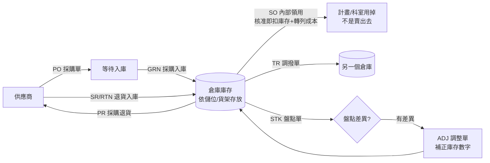

# ERP 流程總覽（白話版）

> **這份文件是給誰看的**：不需要工程背景，一般人也看得懂。如果你是工程師，想看技術規格（API、資料表欄位），請看 [`ERP_SYSTEM.md`](./ERP_SYSTEM.md)。
> **最後更新**：2026-07-22
> **背景**：這份文件是 2026-07-22 使用者發現 `ERP_SYSTEM.md` 有錯誤敘述（誤把系統寫成有「銷貨出庫」）後，討論釐清業務事實＋對照程式碼，決定另外寫一份完整、白話、涵蓋現況缺口的說明文件。
> **相關資料**：[`docs/reviews/2026-07-22-erp-status-investigation.md`](../../reviews/2026-07-22-erp-status-investigation.md)（同日稍早的技術現況調查報告）、[`docs/TODO.md`](../../TODO.md) §R84（追蹤這份文件提到的所有待補強項目）

---

## 0. 一句話講這個系統在幹嘛

這是一個「東西進來、東西被用掉」的記帳系統：藥品、飼料、耗材買進來要記一筆，被拿去做實驗、餵豬用掉了也要記一筆，讓大家隨時知道「倉庫裡還剩多少」、「這些東西花了多少錢」。

**這裡沒有「賣東西給客戶賺錢」這件事**——本公司不對外做買賣，所有離開倉庫的東西都是自己用掉的（內部耗材領用），不是銷貨。這點在系統設計上非常重要，下面會反覆講到。

---

## 1. 一張圖看完整流程

白話翻譯：
1. **買東西**：跟供應商下單（PO）→ 東西送到、驗收清點、正式收進倉庫（GRN）。
2. **東西放在倉庫**：依「哪個倉庫、哪個貨架/儲位」存放，隨時可查現在有多少。
3. **東西被用掉**：計畫/科室要用藥品、耗材，開一張「領用單」（系統裡欄位代碼還叫 SO，是歷史命名，**不是真的銷貨**），核准的當下系統就直接把庫存扣掉、把成本記下來。
4. **倉庫之間搬貨**：用調撥單（TR）。
5. **定期核對帳實**：盤點單（STK）核對「系統說有多少」跟「實際點數有多少」，若不一致，系統自動開一張調整單（ADJ）把數字改對。
6. **買到有問題要退**：退回供應商用採購退貨（PR）；供應商退貨進來用（SR/RTN）。

---

## 2. 每一種單據，白話解釋

| 代碼 | 白話說法 | 什麼時候用 | 會不會扣/加庫存 | 會不會影響帳（會計分錄） |
|---|---|---|---|---|
| **PO** | 採購單 | 決定跟供應商買東西時開立 | 不會（東西還沒收到） | 不會 |
| **GRN** | 採購入庫 | 東西送到、驗收清點完成時開立 | 加庫存 | 借「存貨」／貸「應付供應商的錢」 |
| **PR** | 採購退貨 | 買到的東西有問題要退回供應商 | 扣庫存 | 有對應分錄 |
| **SO**（系統欄位仍叫這個名字，實際是「內部領用單」） | 計畫/科室要用藥品、耗材時開立 | 核准當下 | 直接扣庫存 | 只借「成本」／貸「存貨」——**不記應收帳款、不記營業收入**，因為沒有真的賣錢給誰 |
| ~~DO~~（銷貨出庫） | ~~已經不存在，不能再開新單~~ | — | — | — |
| **TR** | 調撥單 | 東西要從 A 倉庫搬到 B 倉庫 | 一邊扣、一邊加 | 不影響損益，只是位置變了 |
| **STK** | 盤點單 | 定期實際去倉庫數東西核對 | 不直接影響，但會觸發 ADJ | 不會 |
| **ADJ** | 調整單 | 盤點發現數字對不上時，系統自動產生 | 依差異加或扣 | 有對應分錄 |
| **SR / RTN** | 退貨單 | 供應商的退貨、或其他退回情況 | 加庫存 | 有對應分錄 |

**重點**：整張表裡最容易誤會的就是 **SO**——它的系統代碼、頁面元件名稱、API 路徑到現在都還叫 `sales`（銷貨），是因為當初做系統時參考一般 ERP 的教科書命名，但這家公司的實際業務從頭到尾都是「內部用掉」，不是「賣出去」。這是命名跟現實脫節，不是系統邏輯有問題。

---

## 3. 為什麼沒有「銷貨出庫（DO）」這張單

### 3.1 業務事實

本公司**沒有對外銷貨業務**。倉庫裡的東西離開，絕大多數是被某個試驗計畫拿去用掉了（餵豬、做實驗、消毒、包紮…）；少數情況下領用對象不是內部計畫、而是外部合作機構（例如提供樣本給合作單位，系統裡叫「無計畫外部對象領用」，詳見 [`ERP_SYSTEM.md`](./ERP_SYSTEM.md) §5.1），但這種情況**也一樣不是賣給客戶收錢**——會計上照樣只記「用掉的成本」，不記應收帳款、不記營業收入；真的要開發票收款，走系統外流程（見本文件 §7）。

一般教科書 ERP 會把「銷貨」拆成兩張單：先開「銷貨單（SO）」立下「有人欠我們錢」的應收帳款，等貨真的出庫時再開「銷貨出庫（DO）」才真正扣庫存、認列收入。這種兩段式設計是為了處理「錢的權利義務」跟「貨的實際移動」時間點不同步的情況——但**這家公司從來沒有這種情況**，因為根本沒有「客戶欠錢」這回事。

### 3.2 程式碼現況（這是已經落地的事實，不是這次才決定的）

- 2026-07-20（工程內部編號 `#1004`）：SO 改成「一段式」——核准的當下就直接扣庫存、直接記帳，不用等 DO。
- 2026-07-21（`#1005`）：程式碼直接**擋掉建立新的 DO 單**，錯誤訊息寫得很白話：「DO 銷貨出庫已棄用：銷貨請開立 SO 銷貨單（核准即出庫與過帳）」。
- **2026-07-23（`R84-9`）**：連 `DocType::DO` 這個型別本身都從程式碼移除了（連同 `RM` 退料單，見 §6.4）。**prod 查證兩張表皆 0 筆 DO**，所以沒有「舊 DO 單要查歷史」的問題——真的有殘留列的話，程式讀取時會直接報錯而不是靜默誤判（`startup` 每次開機都會檢查並告警）。DB 的 enum 值刻意保留，只清程式碼。
- 會計那邊也配合改了：SO 核准後**只會**記「借：銷貨成本／貸：存貨」（把庫存的錢轉成花掉的成本），**永遠不會**記應收帳款、也**永遠不會**記營業收入——因為根本沒有真的收入這回事。

### 3.3 這次確認後，接下來要處理的技術債（2026-07-22 已查證 prod，見第 6 節）

1. ~~`DocType::DO` 這個單據類型本身（enum 值）~~ —— **2026-07-23 已結案（R84-9，採選項 B）**。查證 prod 完全沒有任何一筆 DO 單（`documents`/`stock_ledger` 皆 0 筆），業務事實與資料庫現況一致。PostgreSQL 的 enum 不支援直接刪值，移除需要「建新型別 → 欄位轉型別 → 刪舊型別」的完整重建，等於為了拿掉一個沒人用的標籤對兩張最核心的表動外科手術——**使用者裁定採選項 B：只清 Rust 死碼、保留 DB enum 值**。`'RM'`（退料單，同屬死值）一併比照處理（R84-12，執行前已查證 prod 0 筆）。詳見規劃書 `docs/reviews/2026-07-22-r84-9-do-enum-removal-plan.md`。
2. 會計科目表裡的「1200 應收帳款」「4100 銷貨收入」——**原本以為只是舊 DO 單相容用、可以移除，查證後推翻這個判斷**：這兩個科目其實還被其他跟 DO 完全無關的現行功能依賴著——「記錄客戶收款」功能（`POST /accounting/ar-receipts`）寫死需要 1200；「銷貨退貨（SR）」這個單據類型目前還能自由建立（沒有像 DO 一樣被擋），核准時一樣會用到 1200 和 4100。**結論：這兩個科目不能刪**，維持現狀。

---

## 4. 錢是怎麼記的（簡易版）

| 情境 | 白話 | 借方 | 貸方 |
|---|---|---|---|
| 買東西進來（GRN） | 欠供應商的錢增加，庫存的錢也增加 | 存貨 | 應付帳款 |
| 內部領用（SO） | 庫存的錢變成「用掉的成本」 | 銷貨成本 | 存貨 |
| 舊的 DO（已停用，prod 0 筆，2026-07-23 起連型別都已移除） | 曾經：又記庫存變成本，又記一筆（不存在的）收入 | 應收帳款＋銷貨成本 | 銷貨收入＋存貨 |

現在只有第二種情況會真的發生。第三種只存在於系統上線初期到 2026-07-21 之前建立的舊單，之後不會再有新的。

---

## 5.「這批貨從哪來、到哪去」——現在查得到多少？

使用者這次提出的核心要求是：**每個產品、每個項目都要知道從哪裡來、到哪裡去，不要有查不出原因的流水單**。以下是老實的現況盤點（不誇大、不隱藏缺口）：

### ✅ 現在做得到的

- 任何一筆庫存異動（`stock_ledger` 裡的一列），**保證**能查到「是哪張單造成的」——資料庫設計上這個欄位不能是空的，結構上不會有「憑空出現的流水」。
- 可以查某個商品現在總共剩多少、分布在哪些倉庫、哪些貨架。
- 可以查某一天、某個倉庫進出了什麼東西。
- 單據詳情頁可以看到每一行的批號、效期。

### ✅ 這輪（2026-07-22 R84）已補強落地的

- **「這批貨完整生命週期」查詢頁面**——已做（R84-6 #1027）：批號時間軸 + 數量對帳，一鍵看某批號從進貨到用掉的全公司流向與剩餘。
- **報表/流水上的單號可點擊**——已做（R84-4 #1024）：直接點單號跳單據詳情，不用再手動搜尋。
- **同單同品項透支成負庫存的漏洞**——已修（R84-1 #1022），並補上資料庫層 `CHECK (>= 0)` 最後防線（R84-2 #1030），繞過應用層的寫入路徑也會被擋。
- **批號強制化擴大**——已做（R84-3 #1031）：`requires_batch_expiry()` 涵蓋擴到退貨(PR/SR)、調撥(TR)；藥品/醫材/耗材/化學品類別的既有品項一次補開批號效期追蹤。

### ❌ 仍待補強的

1. **知道連回單據，但不保證連回單據裡的「哪一行」**——如果一張單裡有好幾個品項，系統目前不強制記錄「這筆庫存變化對應單據裡第幾行」，多數情況下沒問題，但不是 100% 保證。
2. **批號仍不是完全獨立的實體**——R84-3 已擴大「哪些單據強制填批號」、R84-6 也把 `(商品, 批號, 效期)` 當成查詢用的批號身分；但批號本身仍是單據行上的文字欄位，還不是像商品那樣有獨立主檔的一級實體。（此為更大範圍的資料模型演進，非本輪範圍。）
3. **出庫沒有 FEFO（先到期先出）校驗**——查證確認缺口為真（R84-7）：系統不會拒絕用已過期批號出庫，批號/效期純靠人工填。修復（加 FEFO 校驗）另案排入。
4. ~~**正式沖銷（紅字沖銷）機制**~~ —— **2026-07-23 已完成（R84-5）**。資料地基（#1032，migration 139）+ 沖銷邏輯本體 + 兩階段核准工作流皆已落地，錯單不必再用調整單硬改。見 §6.3.1。

**白話總結**：這輪把「查得到這批貨的一生」「點得進單據」「不會算出負庫存」「該追蹤批號的都追蹤」「錯單可以正式沖銷」補起來了；剩下的是更深的資料模型演進（批號一級實體）與出庫效期把關（FEFO），逐案另排。

---

## 6. 補強計畫

> 2026-07-22 已完成盤點＋排優先序＋依序動工。**執行進度**：R84-1（透支修復）、R84-2（庫存量表非負約束）、R84-3（批號強制化）、R84-4（單號可點擊）、R84-6（批號生命週期追溯）**皆已實作並合併落地**；R84-5（正式沖銷單）**已完整落地**——資料地基（`documents.reverses_doc_id`，#1032）+ 沖銷邏輯本體 + 兩階段核准 + 前端雙向可見性，於 local 可測環境實作並以整合測試驗證（2026-07-23）；⚠️ 已完成 local 驗證與合併，**尚未部署至 prod**。R84-9／R84-12（DO／RM 死碼清除）亦已合併。所有項目同步追蹤於 `docs/TODO.md` §R84。

### 6.1 地基優先：先讓庫存數字本身可信

沒有可信的庫存數字，做再好的追溯查詢頁面都是查一堆不能信的資料。

| 項目 | 說明 | 追蹤編號 |
|---|---|---|
| 同一張單裡同商品分兩行可能透支成負庫存 | 建單/核准階段逐行即時重算快照，讓後續行讀到正確餘量；並補整合測試 | `R84-1` ✅ 已落地（#1022） |
| 庫存數字資料表沒有「不能是負的」的資料庫層防線 | 加 `inventory_snapshots.on_hand_qty_base >= 0`、`storage_location_inventory.on_hand_qty >= 0` 兩個 `CHECK` 約束（migration 137），作為繞過應用層寫入路徑的最後防線；附驗收測試（負值 insert/update 皆被拒）。2026-07-22 已查證 prod 無既存負值 | `R84-2` ✅ 已落地（#1030） |

### 6.2 做到「每個項目都知道從哪來、到哪去」（範圍：涵蓋全部品項，不限法規要求最高的品項）

| 項目 | 說明 | 追蹤編號 |
|---|---|---|
| 批號強制化：擴大 `requires_batch_expiry()` 涵蓋 PR/TR/SR + 依 SKU 類別回填 `track_batch`/`track_expiry` 預設值 + 前端表單依類別預填 | 設計見 §6.2.1 | `R84-3` ✅ 已落地（#1031，migration 138） |
| 批號完整生命週期查詢頁面（進貨 → 上架 → 出庫，一次看完） | 設計見 §6.2.2 | `R84-6` ✅ 已落地（#1027，`GET /inventory/lot-movements` + 前端時間軸頁） |
| 流水/報表上的單號改成可以點擊，直接跳到單據詳情 | 純前端小改，風險低、體驗提升大 | `R84-4` ✅ 已落地（#1024） |

#### 6.2.1 R84-3 設計：批號強制化不是「每個 SKU 都逼填」，是擴大檢查範圍 + 分類預設值

**現有機制（不用重新發明）**：`products.track_batch` / `products.track_expiry` 是**兩個各自獨立**的逐品項開關，不是全系統一刀切，彼此也互不綁定——`track_batch=true` 只強制填批號、`track_expiry=true` 只強制填效期，一個品項可以只開一個、開兩個、或都不開。真的沒有批號效期概念的品項（例如工具、儀器），兩個都維持 `false`，永遠不受影響——這解決了「有些東西真的沒有批號」的疑慮。

**這次要做的三件事**：
1. **擴大會做批號/效期檢查的單據類型**：`requires_batch_expiry()` 目前涵蓋 `GRN | DO | SO | ADJ | STK`（`DO` 已於 2026-07-21 被封鎖新建，等同死碼，不影響現況），本次擴大加入 `PR`（採購退貨）、`TR`（調撥）、`SR`（銷貨退貨）——但驗證邏輯維持現況的「兩旗標各自判斷」：`track_batch=true` 才擋缺批號、`track_expiry=true` 才擋缺效期，不影響兩者皆 `false` 的品項。
2. **`track_batch` 與 `track_expiry` 預設值都改用 SKU 類別當起點**（一次性 migration，套用到既有品項 + 影響未來新建品項的預設值；兩欄位分開設定，但這次的類別判斷剛好一致）：

   | 類別代碼 | 類別 | `track_batch` 預設 | `track_expiry` 預設 | `default_expiry_days` | 理由 |
   |---|---|---|---|---|---|
   | `DRG` | 藥品 | `true` | `true` | 依實際效期，逐品項填（無通用預設天數） | 天生有批號效期 |
   | `MED` | 醫材 | `true` | `true` | 同上 | 天生有批號效期 |
   | `CON` | 耗材 | `true` | `true` | 同上 | 多數耗材有批號效期（手套、紗布等例外可事後關閉） |
   | `CHM` | 化學品 | `true` | `true` | 同上 | 天生有批號效期 |
   | `EQP` | 設備 | `false` | `false` | 不適用 | 工具/儀器沒有批號效期概念 |
   | `GEN` | 通用 | `false` | `false` | 不適用 | 類別太籠統，個案處理 |

   `default_expiry_days`（`products` 表既有欄位，GRN 入庫時若單據未填效期可用它推算）**這次不設全類別統一預設天數**——不同藥品/耗材效期差異太大，改由使用者事後逐品項填寫，不用一次性 migration 猜測。

   以上都只是**起點預設值**，套用後使用者仍可逐品項調整（例如某個耗材其實不需要追蹤批號但需要追蹤效期，或反之）。

#### 6.2.2 R84-6 設計：批號時間軸 + 數量對帳（不做族譜樹）

**業界慣例對照**：批號追溯一般分「逆向」（從結果往回查最早來源，召回情境用）跟「正向」（從來源往前查流向何處，問題批號情境用）。有「混批/分裝」的產業（原料混合成新批號）這兩個方向會變成一棵族譜樹；但 iPig 這種 CRO 場景**沒有混批**——藥品/耗材買進來就是直接用掉，不會兩批混成第三批——所以正逆向其實是同一條時間軸換個方向看，**不需要族譜樹**。

**確定範圍**：
- **批號身分＝`(product_id, batch_no, expiry_date)` 三欄一組**，不是只有 `product_id + batch_no`——`storage_location_inventory` 既有的唯一鍵就是這三欄（見 `009_erp_stock.sql` 的 `idx_storage_location_inventory_unique`），同商品同批號但不同效期日期要視為不同批，避免誤把兩批不同效期的貨併成一筆。
- 後端新增唯讀端點：`GET /inventory/lot-movements?product_id=&batch_no=&expiry_date=`，回傳該批號的完整 `stock_ledger` 紀錄（按時間排序），每筆附單據類型/單號/方向/數量/**倉庫**。
- **範圍明定為「跨倉彙總」**：一個批號的貨可能因為調撥橫跨多個倉庫，本頁面刻意呈現「這個批號全公司範圍還剩多少、流向哪裡」，不是單一倉庫視角——每一筆紀錄仍會標示發生在哪個倉庫，方便交叉查證，但加總範圍是整個批號，不分倉。
- **數量對帳摘要**（業界常見、呼應 GLP 受試物質帳規範），明確定義各單據類型怎麼歸類、避免調撥被誤判成短少：

  | 分類 | 對應單據/方向 | 計入對帳方式 |
  |---|---|---|
  | 收到 | `GRN`（`in`） | 加 |
  | 客戶退貨收到 | `SR`/`RTN`（`in`） | 加 |
  | 內部領用 | `SO`（`out`） | 減 |
  | 退回供應商 | `PR`（`out`） | 減 |
  | 調整增減 | `ADJ`（`adjust_in`/`adjust_out`，含盤點差異、報廢） | 淨額計入（增為加、減為減） |
  | 調撥 | `TR`（`transfer_in`/`transfer_out`） | **不計入對帳等式**——同一批號跨倉調撥，全公司範圍內 in/out 必為淨零，只改變「在哪個倉庫」不改變「還剩多少」；時間軸仍會顯示每一筆調撥供交叉查證，但不參與「收到 = 用掉 + 剩餘」的計算，避免調撥被誤判為對不上帳 |

  對帳等式：**收到＋客戶退貨收到＋調整增加 = 內部領用＋退回供應商＋調整減少＋目前剩餘**。等式不成立才是真的異常，要標紅警示。

  ⚠️ **報廢走 `ADJ`（負向調整），不是 `RM`（退料單）**：`RM` 這個單據類型雖然存在於 enum，但前端已註記「保留系統現有型別相容性，但新增頁面可隱藏」（`frontend/src/pages/documents/types.ts:56`），且後端 `process_single_line` 沒有 `RM` 對應分支（不會寫入 `stock_ledger`）——目前實際報廢流程是走 `ADJ` 負向調整。**`docs/training/T43_倉儲作業與庫存查詢.md` 教學「報廢用 RM」已經過時**，與現行系統行為不符，屬於本次順帶發現的獨立文件缺陷，不在這輪修，建議另開一項待辦更新該教材（考題也需要跟著改）。
- 前端新增一個時間軸頁面/面板（從 `InventoryPage` 的批號展開列、或單據詳情頁的品項列，都可以連過去），單號沿用 R84-4 剛做好的可點擊連結。
- 不做族譜樹/圖形化，維持簡單時間軸即可。

#### 6.2.3 R84-6 補強：對帳分級（上線後實測校正，2026-07-23）

§6.2.2 訂的「等式不成立就標紅」上線後實測 prod，**195 個有批號的 lot 有 157 個標紅（81%）**，其中 150 個不是數量出錯。對帳功能 8 成在喊狼來了，紅字就失去意義，因此加一層分級。

**成因**（查 prod 資料 + `ledger.rs:134` 註解得出）：

1. **2026-05-20（migration 069）之前，異動只寫 `stock_ledger` 不寫 `storage_location_inventory`**，兩本帳當年沒有同步在寫。
2. 之後兩輪補救——`ADJ-BASELINE-*`（R62-2 歷史初始庫存補帳，2026-05-25）與 `ADJ-PHANTOMFIX-*`（幻影庫存清理，2026-06-10）——把**品項總量**補平了，但沖銷列**沒有帶批號**（146 列 `adjust_out`、14,037 單位，`batch_no IS NULL`）。差額因此掛在批號之外，貼不回任何一個 lot。

所以這是**批號歸屬**問題，不是數量問題：品項層級 179 個品項有 174 個是平的。

**關鍵性質：一般單據改不了這個差。** migration 069 之後每筆異動都同時寫 ledger 與 SLI，兩邊各 +d，`derived − actual` 恆不變。盤點也一樣——`workflow.rs:821` 的 `let diff = line.qty - current;` 取的是 SLI 現存量，不是帳面推導值。**再盤幾次都不會讓這個差收斂。**

**分級規則**（`LotReconciliationStatus`）：

| 狀態 | 判定 | 呈現 | prod 實測 |
|---|---|---|---|
| `balanced` | 本批號帳實相符 | 綠勾 | 38 |
| `attribution_only` | 本批號不符，但**該品項全部批號合計相符** | 黃字「批號歸屬待確認、總量無虞」 | 150 |
| `unbalanced` | 品項總量也對不上 | 紅字「帳實不符」 | **7** |

紅字從 157 降到 7，且這 7 個正好落在品項層級真正不平的 5 個品項上（`CON-NEE-011` −100、`CON-NEE-009` −100、`CON-DAI-003` −20、`CON-OTH-009` −8、`CON-OTH-020` −2，合計 230 單位，皆為實際多於帳上）。

回傳新增 `status`、`product_derived_total`、`product_remaining_total`、`unattributed_adjust_net`（該品項無批號 ADJ 淨額，供人工追查歸屬）。

**分界線驗證**：以 2026-06-10 切開，之後才產生的 18 個 lot 有 17 個是平的。**現行流程不會再製造新的爛帳**，問題完全是歷史遺留。

#### 6.2.4 R84-11 設計：全倉盤點時逐批重立基準（排程 2026-08）

§6.2.3 只是止血——`attribution_only` 的 150 個 lot 會一直帶著「歸屬待確認」，因為那 146 列無批號的歷史沖銷永遠留在 ledger 裡。根治要靠一次**期初重立基準**，時機綁 2026-08 的全倉盤點（那時本來就要逐貨架逐批號點一次，數字直接就是期初量，不用額外工）。

**為什麼不是「重建資料庫數量」**：數量沒錯（品項層級 174/179 平），清空 `stock_ledger` 重來會不可逆地失去 2026-03～2026-07 的批號流水（718 列），庫存流水報表變空白、R84-6 只剩盤點後的資料——等於廢掉剛上線的追溯功能。`documents`（142 張單據原件）雖然不受影響，但追溯性斷層在 GLP 稽核上要能解釋。**不採用。**

**採用做法**：加一張基準表，對帳改成「期初 + 分界線之後的異動」。

- **新表 `stock_lot_baselines`**：`(product_id, batch_no, expiry_date, qty, as_of, source_doc_id, created_by, created_at)`，唯一鍵 `(product_id, COALESCE(batch_no,''), COALESCE(expiry_date,'1900-01-01'))` 對齊 `idx_storage_location_inventory_unique` 的正規化方式。`source_doc_id` 指向產生它的盤點單（`STK`），保留稽核鏈。
- **對帳改寫**：`derived_remaining = baseline.qty + Σ(trx_date > baseline.as_of 的異動)`。查無 baseline 的批號沿用現行全史累計，行為不變（向後相容）。
- **時間軸不變**：仍顯示該批號**全部**歷史紀錄，並在 baseline 那個時點插一條分隔線標示「盤點重立基準」。追溯性不減。
- **不刪任何一列資料、不改任何一列歷史**，HMAC 稽核鏈完全不動。
- 盤點完成、baseline 寫入後，`attribution_only` 自然歸零，`unbalanced` 只會反映分界線之後真正的差異。

**執行順序**：8 月全倉盤點 → 盤點單核准（既有流程照走，會自動產生帶批號的 ADJ 差異單，把那 5 個品項 230 單位的真差異一併結清）→ 以盤點結果寫入 `stock_lot_baselines` → 對帳切換到基準模式。

### 6.3 單據生命週期的缺口

| 項目 | 說明 | 追蹤編號 |
|---|---|---|
| ~~已核准單據作廢目前沒有正式機制~~ | 系統原本會提示「請用沖銷（reversal）」但機制沒做出來，只能用調整單硬改、追溯鏈斷一次。**2026-07-23 已完整落地**：資料地基（#1032，migration 139）+ 沖銷邏輯本體 + 兩階段核准（WAREHOUSE_MANAGER 發起 → ADMIN 核准，發起人不得自核）+ 前端雙向可見性。設計與實作決定見 §6.3.1 | `R84-5` ✅ 已完成 |

#### 6.3.1 R84-5 設計：正式沖銷單（紅字沖銷），WAREHOUSE_MANAGER 發起 + ADMIN 核准

> **執行狀態（2026-07-23）：✅ 已完整落地。** 資料地基（`documents.reverses_doc_id` + FK + partial unique index，migration 139）於 #1032 落地；沖銷邏輯本體、兩階段核准工作流、前端雙向可見性於 local 可測環境實作並以 7 支整合測試驗證完成（`backend/tests/erp_r84_5_reversal.rs`）。
>
> 程式位置：`services/document/reversal.rs`（`create_reversal` / `approve_reversal`）、`StockService::reverse_document_stock`、`AccountingService::reverse_document_posting`。
> API：`POST /documents/{id}/reverse`（發起）、`POST /documents/{id}/reverse-approve`（ADMIN 核准）。

**核心原則**：沖銷不是「重新跑一次業務邏輯」，而是**原封不動地鏡射**原始單據**實際寫入**的東西——這是標準的「紅字沖銷」做法，也是唯一符合 GLP append-only 精神的方式（原始紀錄完全不動，只新增一筆方向相反的）。

- **新欄位**：`documents.reverses_doc_id`（nullable，`FOREIGN KEY` 指向被沖銷的原單，並加 `UNIQUE` partial index `WHERE reverses_doc_id IS NOT NULL`），放在沖銷單身上，原始單據不動。partial unique index 讓資料庫本身就保證一張原始單據最多只能有一張沖銷單，不能只靠應用層「先查有沒有、再建立」的邏輯——這種 check-then-create 在兩個人（或兩個 admin 核准請求）同時操作時會有 race condition，兩邊都查到「還沒被沖銷」而各自建出一張，資料庫層的 unique 約束是唯一可靠的最後防線。
- **建立規則**：只能沖銷**已核准（approved）**的單據；發起與核准都在同一個 transaction 內對原始單據下 `SELECT ... FOR UPDATE`（比照現有 `approve()` 的鎖定方式）先鎖住，再檢查＋建立沖銷單，鎖+資料庫 unique 約束雙重保證同一張單不會被沖銷兩次。
- **資料鏡射**：沖銷單直接讀原單的 `stock_ledger` 紀錄，逐筆寫「方向相反、數量相同」的新流水（in↔out、transfer_in↔transfer_out…）；會計面讀原單 `journal_entries`，借貸相反地鏡射一張新傳票。不重新呼叫各單據類型的 `process_single_line`，避免因為「當下庫存狀態不同」算出跟原本不一樣的結果。

  ⚠️ **三本帳都要動，缺一即製造新的帳實不符**（2026-07-23 實作時補正——原設計只寫了 `stock_ledger`，照字面實作會重演 migration 069 之前的 storage drift，見 §6.2.3 R84-11 的調查）：

  | 表 | 性質 | 沖銷時怎麼做 |
  |---|---|---|
  | `stock_ledger` | append-only 流水 | 逐筆寫方向相反的新列，掛在沖銷單下 |
  | `storage_location_inventory` | **增量維護，不從 ledger 推導** | **必須顯式反向增減**（原 in 的扣回、原 out 的加回） |
  | `inventory_snapshots` | 從 ledger 全量 SUM 重算（冪等） | 寫完鏡射列後對受影響 (倉,品) 重算即自動對齊 |

  反向扣減儲位庫存時若不足（例如原入庫的貨已被領用），既有的 `decrement_storage_location_inventory` 會回「儲位庫存不足」而使整筆 tx rollback——**這是正確行為**：東西已經不在了就不能假裝退回去。migration 137 的非負 CHECK 是最後防線。

- **會計鏡射不採 best-effort**（2026-07-23 使用者裁定，刻意偏離既有模式）：一般單據核准的 `post_accounting_best_effort` 以 SAVEPOINT 隔離、會計失敗不阻擋核准；但沖銷若庫存已退回、傳票卻沒鏡射成功，帳會永久歪掉且無從察覺。沖銷屬合規路徑，**會計鏡射失敗即整筆 rollback**。

- **實作決定**（規格未明訂，2026-07-23 定）：沖銷單**沿用原單 `doc_type`**（不新增 DB enum 值，與 R84-9 選項 B 一致），靠 `reverses_doc_id` 辨識；狀態流**複用既有 `requires_manager_approval` / `manager_approval_status`** 欄位（比照大金額 ADJ 的 SoD 範式，不需 migration）；**沖銷單本身不可再被沖銷**（要回復請重開原類型單據，不做無限套疊）；明細原樣複製且數量為正（方向相反體現在 ledger，否則會撞到「移動單據 qty 必須 > 0」的驗證）。
- **兩階段權限（2026-07-22 使用者裁定）**：`WAREHOUSE_MANAGER` 可以**發起**沖銷（建立草稿），但必須經 `ADMIN` **最終核准**才會真的執行鏡射寫入——比照一般單據的建立/核准分離（SoD），沖銷這種高風險操作不能由發起人自己核准。
- **可見性（已實作）**：單據詳情頁的 `ReversalNotice` 卡片雙向顯示——原單顯示「此單已被沖銷（單號 XXX、生效時間）」、沖銷單顯示「本單是 XXX 的沖銷單」，兩者皆可點擊互跳。沖銷單**尚未核准**時原單顯示「沖銷處理中」而非「已被沖銷」，避免使用者誤以為帳已經沖掉（庫存與會計要等 ADMIN 核准才反向）。後端 `DocumentWithLines` 為此補了 `reverses_doc_no` / `reversed_by_doc_id` / `reversed_by_doc_no` / `reversed_at` 四個欄位（原單身上沒有「誰沖銷了我」，需反向查詢）。

- ⚠️ **沖銷單不可走一般 `admin_approve`**（實作時發現的陷阱，已於前後端雙層擋下）：沖銷單同樣帶 `requires_manager_approval = true` + `manager_approval_status = 'wm_approved'`，恰好符合一般最終核准的前置條件。但那條路會呼叫 `process_document`——用「當下庫存狀態」**重跑業務邏輯**而非鏡射原單，且不會反向扣減儲位庫存。後端 `admin_approve` 已加守衛拒絕並導引至沖銷流程，前端也把沖銷單從「最終核准」按鈕排除、改顯示「核准沖銷」。測試 `reversal_cannot_go_through_normal_admin_approve` 鎖住此行為。
- 整個沖銷流程一樣走 Service-driven Audit Pattern，寫入 HMAC 稽核鏈。

### 6.4 這次新增的技術債清理（2026-07-22 已查證 prod，結論見下）

| 項目 | 說明 | 追蹤編號 |
|---|---|---|
| ~~移除 `DocType::DO` 這個單據類型（含程式碼裡的相容分支）~~ | **2026-07-23 已完成（採選項 B）**：prod `documents`／`stock_ledger` 皆 0 筆 DO。PostgreSQL enum 不支援直接刪值、完整型別重建等於對兩張核心表動外科手術——使用者裁定**只清 Rust 死碼、保留 DB enum 值**。清理範圍：`models/document.rs` 的 variant 與 4 個方法的 match arm、`accounting.rs`(service+repo)／`crud.rs`／`workflow.rs`／`stock/ledger.rs`／`notification/erp.rs`／`report.rs` 共 11 處 DO 分支與 SQL、前端 17 檔 | `R84-9` ✅ 已完成 |
| ~~移除 `DocType::RM`（退料單）死碼~~ | **2026-07-23 已完成**：`RM` 同屬死值（前端隱藏、後端 `process_single_line` 無分支），執行前查證 prod `documents`／`stock_ledger` 皆 0 筆，比照選項 B 清死碼、保留 DB enum 值 | `R84-12` ✅ 已完成 |
| ~~移除會計科目表裡的「1200 應收帳款」「4100 銷貨收入」~~ | **查證後推翻原判斷、決定不做**：這兩個科目仍被跟 DO 無關的現行功能依賴——`POST /accounting/ar-receipts`（記錄客戶收款）寫死需要 1200；「銷貨退貨（SR）」單據目前未被封鎖新建，核准時仍會用到 1200 與 4100。移除會直接打壞這兩個現行功能，**維持現狀，不移除** | `R84-10`（已結案：決定不做） |

#### 6.4.1 SR／RTN 的會計語意與業務事實不符（2026-07-23 裁定，追蹤 R84-13）

**使用者裁定**：ERP 的出庫**全部**是「實驗完成後記錄消耗掉多少耗材／藥品」，**沒有價金**——業務上根本不存在「銷貨退貨」這件事。

**現況問題**：`post_sr` 仍停在 DO 時代的做法，過帳「借：銷貨收入／貸：應收帳款」——但 SO 從不認列收入，等於**沖銷一筆從未發生的收入**。`report.rs` 6 處 SQL 也仍把 SR/RTN 當銷貨退貨計入淨銷貨與毛利；`repositories/accounting.rs` 的 AR 帳齡同樣納入 SR/RTN。

**目前無實害，但是條件式地雷**（2026-07-23 查證 prod）：

| 檢查 | 結果 |
|---|---|
| SR 單據 | 0 張 |
| RTN 單據 | 0 張 |
| 科目 1200／4100 的分錄 | 0 筆 |
| 有填單價的 SO 明細 | 0 筆 |

SR **不像 SO 那樣被擋單價**（`validate_line_qty_price` 只對 SO 拒絕單價）。一旦有人開 SR、填了單價並核准，帳上就會憑空多出一筆負收入與負應收；若單價留空則金額為 0、`retain_postable_lines` 會略過那兩行，反而是正確的——所以踩不踩得到取決於有沒有填單價。

**方向**（細節見 `TODO.md` R84-13）：① 比照 DO（#1005）封鎖 SR/RTN 新建；② 確認無殘留後比照 R84-9 選項 B 清死碼、DB enum 值保留；③「未用完的耗材退回倉庫」若真有需求，用 ADJ 或 R84-5 沖銷單處理即可，不需要 SR。

### 6.5 還需要查證、但這次不做的

| 項目 | 說明 | 追蹤編號 |
|---|---|---|
| 出庫時有沒有檢查「不能用過期的批號」（FEFO：先到期先出） | **2026-07-22 查證完成，確認缺口為真**：`crud.rs`（建單/改單驗證）與 `ledger.rs`（出庫扣帳）皆無任何「過期批號擋下扣帳」的邏輯，`batch_no`/`expiry_date` 純靠人工填。修復本身（加 FEFO 校驗）未列入本輪，另案排入 | `R84-7` ✅ 查證完成（修復另案） |

---

## 7. 不在這個系統裡處理的事（2026-07-22 確認）

- **管制藥品簿冊**（麻醉藥、安樂死用藥依法要有的專用登記簿）：目前在系統外處理（紙本或其他系統），本次確認**這個系統內部不做整合**，維持現狀。
- **統一發票開立、收款**：同樣在系統外處理，ERP 不負責開票或收款流程。

> ⚠️ 這兩項目前只有「口頭確認在系統外處理」，沒有查證外部流程實際上如何跟 ERP 對帳。如果將來外部流程需要跟 ERP 的數字核對，需要再另外討論。

---

## 8. 相關文件

- [`ERP_SYSTEM.md`](./ERP_SYSTEM.md) — 給工程師看的技術規格（資料表欄位、API 端點、SKU 規則）
- [`docs/reviews/2026-07-22-erp-status-investigation.md`](../../reviews/2026-07-22-erp-status-investigation.md) — 同日稍早的技術現況調查報告（四路並行程式碼掃描的完整發現）
- [`docs/TODO.md`](../../TODO.md) §R84 — 本文件提到的所有待補強項目的追蹤清單
- [動物管理](./ANIMAL_MANAGEMENT.md) — 血液檢查費用如何跟 ERP 連動
